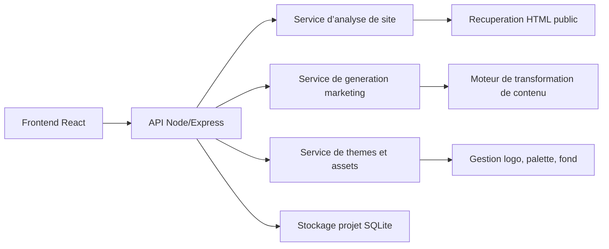
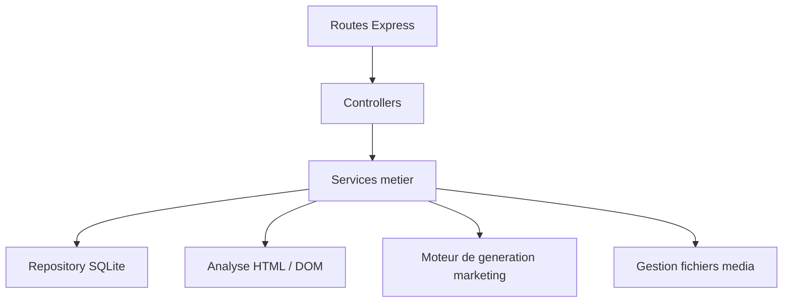
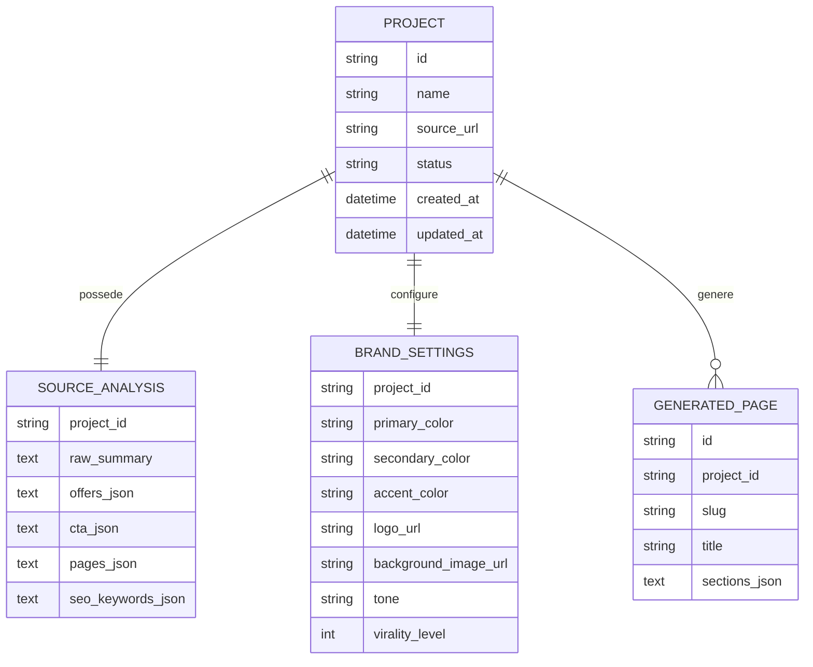

## 1. Conception de l’architecture


## 2. Description technique
- Frontend : React 18 + TypeScript + Vite + Tailwind CSS 3.
- Initialisation : Vite.
- Backend : Node.js + Express 4 + TypeScript.
- Base de donnees : SQLite pour conserver les projets, snapshots d’analyse et parametres de personnalisation.
- Rendu : SPA avec apercu en temps reel et API locale pour l’analyse et la generation.
- Extraction de site : recuperation HTML publique, parsing DOM, detection des sections, titres, liens, CTA, offres et informations de contact.
- Generation : moteur de transformation base sur regles, templates marketing et prompts structures cote serveur.

## 3. Definition des routes front
| Route | Role |
|-------|------|
| / | Accueil et saisie de l’URL source |
| /projet/nouveau | Creation d’un projet a partir d’un site source |
| /projet/:id/analyse | Visualisation de l’analyse du site importe |
| /projet/:id/studio | Reglages marketing et branding |
| /projet/:id/preview | Previsualisation du nouveau site |
| /projet/:id/export | Export, publication et historique |

## 4. Definitions d’API
### 4.1 Types principaux
```ts
export type BrandSettings = {
  primaryColor: string;
  secondaryColor: string;
  accentColor: string;
  logoUrl?: string;
  backgroundImageUrl?: string;
  tone: 'premium' | 'direct' | 'luxe' | 'viral' | 'expert';
  viralityLevel: 1 | 2 | 3 | 4 | 5;
};

export type SourceSiteAnalysis = {
  sourceUrl: string;
  pages: Array<{ url: string; title: string; headings: string[] }>;
  offers: string[];
  callsToAction: string[];
  socialProof: string[];
  contactInfo: string[];
  toneSummary: string;
  seoKeywords: string[];
};

export type GeneratedSite = {
  siteName: string;
  positioning: string;
  pages: Array<{
    slug: string;
    title: string;
    sections: Array<{ type: string; content: Record<string, unknown> }>;
  }>;
  shareHooks: string[];
};
```

### 4.2 Endpoints
| Methode | Route | Usage |
|---------|-------|-------|
| POST | /api/projects | Cree un projet avec URL source |
| POST | /api/projects/:id/analyze | Lance l’analyse du site source |
| GET | /api/projects/:id/analyze | Recupere les resultats d’analyse |
| PUT | /api/projects/:id/brand | Sauvegarde couleurs, logo, fond et ton |
| POST | /api/projects/:id/generate | Genere la nouvelle structure de site |
| PUT | /api/projects/:id/content | Met a jour manuellement les contenus |
| GET | /api/projects/:id/preview | Retourne les donnees de preview |
| POST | /api/projects/:id/export | Produit un export du site |

## 5. Diagramme d’architecture serveur


## 6. Modele de donnees
### 6.1 Modele ER


### 6.2 DDL
```sql
CREATE TABLE projects (
  id TEXT PRIMARY KEY,
  name TEXT NOT NULL,
  source_url TEXT NOT NULL,
  status TEXT NOT NULL DEFAULT 'draft',
  created_at TEXT NOT NULL,
  updated_at TEXT NOT NULL
);

CREATE TABLE source_analysis (
  project_id TEXT PRIMARY KEY,
  raw_summary TEXT NOT NULL,
  offers_json TEXT NOT NULL,
  cta_json TEXT NOT NULL,
  pages_json TEXT NOT NULL,
  seo_keywords_json TEXT NOT NULL,
  FOREIGN KEY (project_id) REFERENCES projects(id)
);

CREATE TABLE brand_settings (
  project_id TEXT PRIMARY KEY,
  primary_color TEXT NOT NULL,
  secondary_color TEXT NOT NULL,
  accent_color TEXT NOT NULL,
  logo_url TEXT,
  background_image_url TEXT,
  tone TEXT NOT NULL,
  virality_level INTEGER NOT NULL DEFAULT 3,
  FOREIGN KEY (project_id) REFERENCES projects(id)
);

CREATE TABLE generated_pages (
  id TEXT PRIMARY KEY,
  project_id TEXT NOT NULL,
  slug TEXT NOT NULL,
  title TEXT NOT NULL,
  sections_json TEXT NOT NULL,
  FOREIGN KEY (project_id) REFERENCES projects(id)
);

CREATE INDEX idx_generated_pages_project_id ON generated_pages(project_id);
```

## 7. Principes d’implementation
- Frontend desktop-first avec apercu visuel immersif et edition rapide.
- Backend modulaire pour separer l’analyse, la generation de contenu et l’export.
- Pipeline d’analyse limite au contenu public et structure pour eviter les comportements fragiles.
- Systeme de generation pense pour produire un site original, pas une duplication pixel-perfect.
- Journalisation des etapes d’analyse et de generation pour faciliter le debogage et l’amelioration continue.
