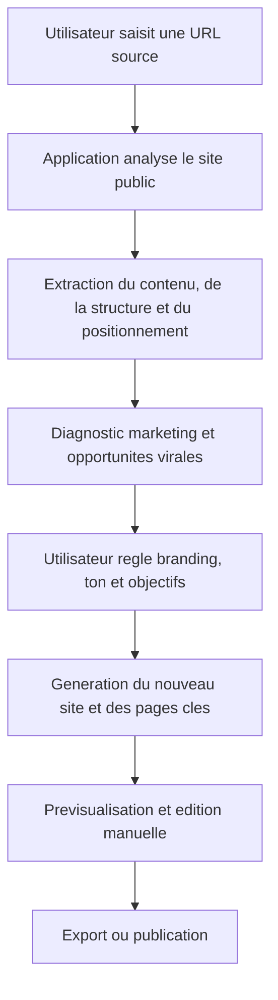

## 1. Vue d’ensemble du produit
Application web de generation de sites marketing qui prend l’URL d’un site existant, analyse son contenu public, puis produit un nouveau site differencie, plus percutant et personnalisable.
- Le produit s’adresse aux independants, TPE/PME, freelances, agences et equipes marketing qui veulent relancer rapidement une presence web plus moderne, plus virale et mieux orientee conversion.
- La valeur marche repose sur la vitesse d’execution, la reutilisation intelligente d’informations publiques, la personnalisation de marque et la creation de pages pensees pour etre partagees et convertissantes.

## 2. Fonctionnalites principales

### 2.1 Roles utilisateurs
| Role | Methode d’acces | Permissions principales |
|------|------------------|-------------------------|
| Utilisateur standard | Session locale / compte simple | Importer un site source, configurer la marque, generer un site, previsualiser et exporter |
| Administrateur | Compte securise | Gerer les quotas, modeles, reglages avances, historique des generations |

### 2.2 Modules fonctionnels
1. **Accueil / Tableau de bord** : saisie de l’URL source, presentation de la promesse, historique des projets, acces aux modeles.
2. **Analyse du site source** : crawl du site public, extraction du positionnement, des offres, des preuves sociales, de la structure de pages, du ton et des appels a l’action.
3. **Studio de transformation marketing** : reglages des couleurs, logo, image de fond, ton de marque, intensite marketing, angle viral, differenciation concurrentielle.
4. **Generateur de site** : creation d’une arborescence, reecriture marketing, composition visuelle, sections virales, CTA, FAQ, preuves sociales et lead magnets.
5. **Previsualisation et edition** : apercu desktop/mobile, ajustement de textes, remplacement d’images, reorganisation des blocs.
6. **Export et publication** : export du site, copie du code, generation de version de demonstration, publication sur hebergement cible.

### 2.3 Detail des pages
| Nom de la page | Nom du module | Description fonctionnelle |
|----------------|---------------|---------------------------|
| Accueil | Hero de conversion | Presente la promesse "transformer un site existant en nouveau site performant", avec champ URL, benefices et demonstration visuelle |
| Accueil | Preuves marketing | Met en avant rapidite, differenciation, optimisation conversion, branding personnalisable |
| Projet | Analyse source | Affiche les pages detectees, messages-cles, offres, mots recurrents, structure et elements reutilisables |
| Projet | Diagnostic marketing | Identifie faiblesses, opportunites virales, clarte de l’offre, preuve sociale manquante, coherence SEO |
| Projet | Personnalisation visuelle | Permet de modifier palette, logo, fond d’ecran, typographies, intensite visuelle, ambiance de marque |
| Projet | Generation de contenu | Propose slogans, accroches, storytelling, CTA, sections FAQ, comparatifs, temoignages et lead magnet |
| Projet | Generation de structure | Construit la home, landing pages, sections services, a propos, contact, capture email |
| Previsualisation | Vue responsive | Permet d’inspecter le rendu desktop et mobile avec interactions, animations et hierarchie visuelle |
| Previsualisation | Edition rapide | Autorise la correction manuelle des textes, images, boutons et sections |
| Export | Publication | Exporte le code, prepare un package deployable et archive les versions |

## 3. Processus principaux
Le parcours principal commence par l’entree d’une URL publique. L’application analyse le site source, extrait la matiere utile, puis la reformule dans une logique de differenciation marketing plutot que de copie. L’utilisateur ajuste ensuite l’identite visuelle et les parametres de conversion pour obtenir un nouveau site plus memorable et plus partageable.

Un second parcours permet de partir d’un projet deja genere pour iterer rapidement : changer les couleurs, remplacer le logo, injecter une nouvelle image de fond, choisir un autre angle marketing et regenerer certaines sections sans repartir de zero.

## 4. Design de l’interface
### 4.1 Style visuel
- Couleurs principales : anthracite profond, ivoire chaud, accent corail electrique ou vert neon selon le mode choisi.
- Couleurs secondaires : bleu nuit, sable dore, degrades subtils pour les zones d’impact.
- Style des boutons : grands boutons contrastes, legerement arrondis, ombres nettes et micro-interactions rapides.
- Typographies : une police d’affichage editoriale a forte personnalite et une police de lecture elegante pour le contenu.
- Style de mise en page : desktop-first, composition editoriale premium, larges blocs narratifs, cartes d’analyse, panneaux lateraux de reglages.
- Style d’icones : minimal premium, pictogrammes fins et visuels d’avant/apres.

### 4.2 Vue d’ensemble des pages
| Nom de la page | Nom du module | Elements UI |
|----------------|---------------|-------------|
| Accueil | Hero | Titre a fort impact, champ URL, promesse, animation d’avant/apres, CTA principal |
| Accueil | Demonstration | Cartes de benefices, resultats attendus, bandeau de credibilite, exemples de transformation |
| Projet | Panneau d’analyse | Cartes metriques, structure detectee, ton de marque, recommandations marketing |
| Projet | Studio visuel | Selecteur de palette, upload logo, image de fond, apercu en temps reel |
| Projet | Generateur | Onglets "contenu", "structure", "viralite", "SEO", "conversion" |
| Previsualisation | Canvas site | Apercu realiste, transitions, changement de page, mode desktop/mobile |
| Export | Actions finales | Boutons export, duplication, publication, historique des versions |

### 4.3 Responsive
Approche desktop-first avec adaptation mobile soignee. Les panneaux de reglage deviennent des tiroirs sur mobile, les apercus passent en mode pile, et les interactions critiques restent accessibles au tactile.

## 5. Contraintes et principes produit
- L’application n’a pas vocation a cloner un site a l’identique ; elle doit transformer des informations publiques en un site original, plus performant et plus coherent avec la nouvelle marque.
- Les contenus recuperes sont limites aux pages publiques accessibles sans authentification.
- L’application doit afficher clairement les elements detectes, les contenus reecrits et les blocs generes afin que l’utilisateur garde le controle editorial.
- La viralite doit etre pilotee par des mecaniques concretes : accroches partageables, structure emotionnelle, preuve sociale, friction faible, CTA visibles et lead magnets.
- Une couche de securite doit empecher l’import d’URLs non valides et limiter les abus de crawl.

## 6. Indicateurs de succes
- Temps moyen pour passer d’une URL source a une premiere version du nouveau site.
- Taux d’utilisation des reglages de branding (couleurs, logo, fond).
- Taux d’export ou de publication apres generation.
- Taux d’iteration sur les variantes marketing generees.
- Satisfaction utilisateur sur la differenciation percue et la qualite de conversion.
