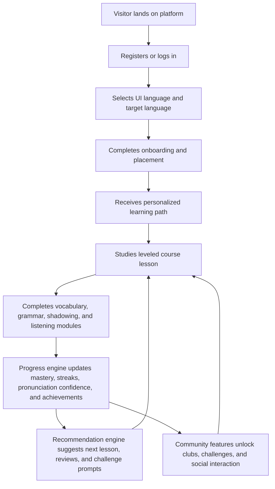

## 1. Product Overview
An immersive online education platform for learning English, Japanese, Korean, and other mainstream languages through structured lessons, interactive practice, progress intelligence, cultural context, and community motivation.
- The product serves self-directed learners, exam-oriented learners, hobbyists, and professionals who want a guided, personalized, and socially engaging language-learning experience across multiple interface languages.
- The market value comes from combining leveled curriculum, multimodal practice, adaptive recommendations, multilingual localization, and community incentives in one cohesive web platform.

## 2. Core Features

### 2.1 User Roles
| Role | Registration Method | Core Permissions |
|------|---------------------|------------------|
| Learner | Email, social sign-in | Enroll in courses, complete exercises, track progress, join community |
| Community Moderator | Admin invitation | Moderate discussions, review reports, manage featured challenges |
| Content Admin | Admin invitation | Manage courses, levels, modules, achievement rules, recommendation inputs |

### 2.2 Feature Module
1. **Landing and discovery page**: product introduction, language catalog, level system overview, testimonials, pricing or plan callouts
2. **Authentication and onboarding**: registration, login, UI language selection, language goals, level placement, learning preference survey
3. **Learner dashboard**: daily goals, streaks, recommended next lesson, progress heatmap, achievement summary
4. **Course learning page**: course map, units, lessons, checkpoints, prerequisite locking, level milestones
5. **Interactive practice page**: vocabulary drills, grammar exercises, oral shadowing, listening practice, instant feedback
6. **Progress and analytics page**: skill mastery, completion rate, time spent, pronunciation trends, review queue
7. **Community page**: discussion feed, study clubs, peer challenges, leaderboard, badges, achievement celebrations
8. **Admin content console**: curriculum management, exercise templates, recommendation rules, moderation workflow

### 2.3 Page Details
| Page Name | Module Name | Feature description |
|-----------|-------------|---------------------|
| Landing and discovery | Language selector | Switch supported UI languages such as English, Japanese, Korean, French, Spanish, German, and Chinese without leaving the page |
| Landing and discovery | Course showcase | Highlight CEFR-like or custom level tracks from beginner to advanced by language |
| Authentication and onboarding | Placement and goals | Collect target language, current proficiency, study intensity, preferred module types, weekly goals, and learning motivation |
| Authentication and onboarding | Localization preferences | Let users select interface language, subtitle preference, transliteration support, and notification language |
| Learner dashboard | Daily mission panel | Show tasks for memorization, grammar, shadowing, and listening based on current plan |
| Learner dashboard | Recommendation rail | Surface the next best lesson, review cards, and community challenge suggestions |
| Course learning | Level roadmap | Display levels, units, dependencies, unlock conditions, and completion status |
| Course learning | Lesson player | Render lesson content, dialogue scenes, examples, audio clips, pronunciation cues, cultural notes, and transition into practice modules |
| Interactive practice | Vocabulary memorization | Flashcards, spaced repetition, image or sentence hints, confidence rating, and retry loop |
| Interactive practice | Grammar exercises | Fill-in-the-blank, sentence ordering, error correction, and rule explanation panels |
| Interactive practice | Oral shadowing | Play reference audio, record learner attempt, compare timing, display waveform alignment, and show self-evaluation cues |
| Interactive practice | Listening training | Dictation, multiple-choice comprehension, transcript reveal, speaker variation, and slow-speed replay |
| Progress and analytics | Mastery dashboard | Track vocabulary retention, grammar accuracy, listening score, speaking completion, pronunciation confidence, and streaks |
| Progress and analytics | Milestone history | Visualize level completions, achievements earned, consistency, and weak-skill alerts |
| Community | Social feed | Post study updates, ask questions, share achievements, and react to peers |
| Community | Achievement incentives | Grant points, badges, streak rewards, challenge trophies, and seasonal ranking rewards linked to course progress |
| Community | Study clubs | Join language-specific groups, weekly speaking circles, and themed challenges for accountability |
| Admin content console | Course manager | Create languages, levels, units, lessons, and metadata for recommendations |
| Admin content console | Localization manager | Maintain translations, subtitle text, transliteration assets, and region-specific notices |
| Admin content console | Community moderation | Review flagged posts, manage badges, and feature seasonal events |

## 3. Core Process
New users discover the platform, register, select a target language and interface language, complete a placement or self-assessment, and receive a personalized learning path. They then follow leveled courses that mix vocabulary, grammar, oral shadowing, and listening experiences with immediate feedback, progress tracking, and adaptive review scheduling. Community participation, study clubs, and achievement systems reinforce consistency, while admins maintain curriculum quality, localization accuracy, and engagement programs.

## 4. User Interface Design
### 4.1 Design Style
- Primary colors: deep navy, luminous teal, coral accent, and warm ivory for contrast-rich educational focus
- Button style: rounded high-contrast buttons with subtle depth, active-state glow, and clear hierarchy for primary actions
- Fonts and sizes: distinctive editorial display font for headlines paired with a highly legible sans-serif for study content and multilingual scripts
- Layout style: desktop-first split-panel experience with immersive lesson workspace, dashboard cards, and sticky navigation
- Icon style suggestions: clean outlined icons, progress rings, level badges, sound-wave motifs, and celebratory motion for achievements

### 4.2 Page Design Overview
| Page Name | Module Name | UI Elements |
|-----------|-------------|-------------|
| Landing and discovery | Hero area | Bold multilingual headline, animated language chips, testimonial ribbon, premium call-to-action |
| Authentication and onboarding | Goal survey | Stepper layout, cards for learning objectives, language selectors, and confidence sliders |
| Learner dashboard | Progress overview | Heatmap, streak badge, radial charts, quick-start lesson launcher, recommendation cards, and review urgency markers |
| Course learning | Lesson workspace | Left course map, center lesson content, right contextual tips, vocabulary bookmarks, and pronunciation helper |
| Interactive practice | Practice canvas | Large answer area, audio controls, waveform visual, instant feedback banners, success animations, and accessibility hints |
| Progress and analytics | Analytics board | Skill trend charts, mastery bars, milestone cards, weak-area alerts, pronunciation history, and export-ready summaries |
| Community | Social hub | Challenge cards, post composer, leaderboard strip, badge gallery, study club panels, and event banners |
| Admin content console | Management tables | Search, filters, inline actions, content preview drawer, moderation status tags |

### 4.3 Responsiveness
The platform follows a desktop-first approach with responsive adaptation for tablets and mobile devices. Complex learning modules collapse into stacked panels on smaller screens, audio controls remain thumb-friendly, and key study actions stay accessible through persistent bottom navigation.
