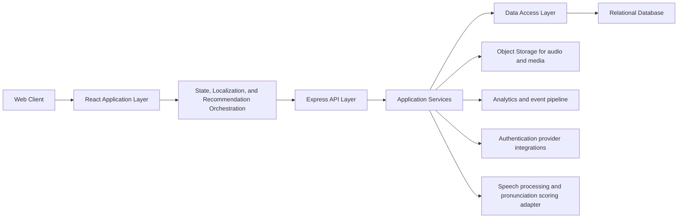
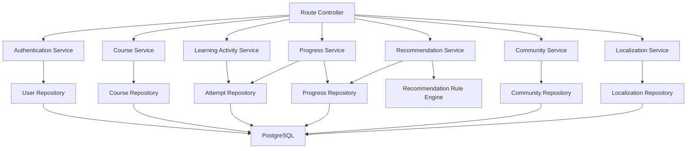
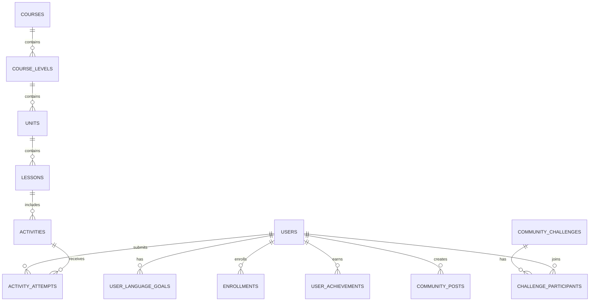

## 1. Architecture Design


## 2. Technology Description
- Frontend: React 18 + TypeScript + Vite + React Router + Zustand + Tailwind CSS
- Initialization Tool: existing Vite application in current workspace
- Backend: Express 4 + TypeScript REST API
- Database: PostgreSQL for production data storage
- Media: object storage for lesson audio, pronunciation references, and badge assets
- Authentication: JWT-based session handling with optional OAuth providers
- Analytics: internal event collection persisted through backend services for progress and recommendation signals
- Localization: translation dictionaries, language fallback rules, subtitle preferences, and transliteration metadata
- Recommendation strategy: hybrid rules engine combining current level, weak-skill trends, spaced review, and community events
- Speech layer: upload and evaluation pipeline for shadowing attempts with waveform timing and pronunciation confidence scoring

## 3. Route Definitions
| Route | Purpose |
|-------|---------|
| / | Marketing landing page and platform entry |
| /auth/login | User login |
| /auth/register | User registration |
| /onboarding | Goal setup, target language selection, and placement flow |
| /dashboard | Learner home with progress snapshot and recommendations |
| /settings/language | Interface language, subtitle, transliteration, and notification preferences |
| /courses | Course catalog by language and level |
| /courses/:languageCode/:courseSlug | Level roadmap and unit list |
| /learn/:lessonId | Immersive lesson player with context and practice launch |
| /practice/:activityId | Interactive vocabulary, grammar, shadowing, or listening module |
| /progress | Analytics, mastery tracking, streaks, and review queue |
| /community | Social feed, clubs, challenges, and achievement boards |
| /profile | Account settings, language preferences, and achievement history |
| /admin | Content and moderation console for privileged users |

## 4. API Definitions

### 4.1 Core Type Definitions
```ts
type SupportedUiLanguage =
  | 'en'
  | 'ja'
  | 'ko'
  | 'fr'
  | 'de'
  | 'es'
  | 'zh-CN'
  | 'zh-TW'
  | 'pt-BR'

type TargetLanguage =
  | 'english'
  | 'japanese'
  | 'korean'
  | 'french'
  | 'german'
  | 'spanish'
  | 'mandarin'

type SkillType = 'vocabulary' | 'grammar' | 'listening' | 'speaking'

type ActivityType = 'flashcard' | 'quiz' | 'shadowing' | 'dictation'

interface LocalizationPreferences {
  uiLanguage: SupportedUiLanguage
  subtitleLanguage?: SupportedUiLanguage
  transliterationEnabled: boolean
  notificationLanguage: SupportedUiLanguage
}

interface UserProfile {
  id: string
  email: string
  displayName: string
  uiLanguage: SupportedUiLanguage
  localizationPreferences: LocalizationPreferences
  targetLanguage: TargetLanguage
  currentLevel: string
  weeklyGoalMinutes: number
  interests: string[]
}

interface LessonRecommendation {
  lessonId: string
  reason: 'next_in_path' | 'weak_skill' | 'streak_support' | 'community_event'
  confidence: number
}

interface ProgressSnapshot {
  userId: string
  streakDays: number
  completedLessons: number
  masteryBySkill: Record<SkillType, number>
  pronunciationConfidence: number
  upcomingReviewCount: number
  achievements: string[]
}
```

### 4.2 REST Endpoints
| Method | Endpoint | Purpose |
|--------|----------|---------|
| POST | /api/auth/register | Create learner account |
| POST | /api/auth/login | Authenticate user and issue token |
| GET | /api/me | Fetch signed-in user profile and onboarding status |
| PUT | /api/me/preferences | Update UI language, target language, and study preferences |
| GET | /api/i18n/:locale | Load localized interface dictionary and copy bundle |
| POST | /api/onboarding/placement | Submit placement answers and derive starting level |
| GET | /api/courses | List supported languages, tracks, and levels |
| GET | /api/courses/:courseId | Fetch course roadmap, units, and unlock rules |
| GET | /api/lessons/:lessonId | Retrieve lesson content and linked activities |
| POST | /api/activities/:activityId/attempts | Submit practice results and progress events |
| POST | /api/activities/:activityId/shadowing-audio | Upload learner recording metadata for shadowing evaluation |
| GET | /api/progress/overview | Return learner analytics and review queue summary |
| GET | /api/recommendations/next | Return personalized next lessons and review activities |
| GET | /api/community/feed | Return posts, challenges, and club highlights |
| POST | /api/community/posts | Create a discussion or achievement post |
| POST | /api/community/challenges/:challengeId/join | Join a community challenge |
| GET | /api/admin/curriculum | Manage languages, levels, lessons, and module templates |

### 4.3 Request and Response Examples
```ts
interface SubmitActivityAttemptRequest {
  activityId: string
  lessonId: string
  activityType: ActivityType
  score: number
  durationSeconds: number
  answers: Array<{
    itemId: string
    isCorrect: boolean
    responseText?: string
    confidence?: number
  }>
}

interface SubmitActivityAttemptResponse {
  success: true
  progress: ProgressSnapshot
  awardedAchievements: string[]
  nextRecommendations: LessonRecommendation[]
}

interface SubmitShadowingAudioResponse {
  success: true
  pronunciationConfidence: number
  timingAlignmentScore: number
  feedbackHints: string[]
}
```

## 5. Server Architecture Diagram


## 6. Data Model
### 6.1 Data Model Definition


### 6.2 Data Definition Language
```sql
CREATE TABLE users (
  id UUID PRIMARY KEY,
  email VARCHAR(255) UNIQUE NOT NULL,
  password_hash TEXT NOT NULL,
  display_name VARCHAR(120) NOT NULL,
  ui_language VARCHAR(16) NOT NULL DEFAULT 'en',
  created_at TIMESTAMP NOT NULL DEFAULT NOW()
);

CREATE TABLE user_language_goals (
  id UUID PRIMARY KEY,
  user_id UUID NOT NULL REFERENCES users(id) ON DELETE CASCADE,
  target_language VARCHAR(32) NOT NULL,
  starting_level VARCHAR(32) NOT NULL,
  current_level VARCHAR(32) NOT NULL,
  weekly_goal_minutes INTEGER NOT NULL DEFAULT 150,
  recommendation_profile JSONB NOT NULL DEFAULT '{}'::jsonb
);

CREATE TABLE localization_resources (
  id UUID PRIMARY KEY,
  locale_code VARCHAR(16) NOT NULL,
  namespace VARCHAR(80) NOT NULL,
  translations JSONB NOT NULL,
  updated_at TIMESTAMP NOT NULL DEFAULT NOW()
);

CREATE TABLE courses (
  id UUID PRIMARY KEY,
  language_code VARCHAR(32) NOT NULL,
  title VARCHAR(160) NOT NULL,
  description TEXT NOT NULL,
  status VARCHAR(24) NOT NULL DEFAULT 'draft'
);

CREATE TABLE lessons (
  id UUID PRIMARY KEY,
  course_id UUID NOT NULL REFERENCES courses(id) ON DELETE CASCADE,
  unit_id UUID NOT NULL,
  level_code VARCHAR(32) NOT NULL,
  title VARCHAR(160) NOT NULL,
  lesson_order INTEGER NOT NULL,
  estimated_minutes INTEGER NOT NULL DEFAULT 15
);

CREATE TABLE activities (
  id UUID PRIMARY KEY,
  lesson_id UUID NOT NULL REFERENCES lessons(id) ON DELETE CASCADE,
  activity_type VARCHAR(24) NOT NULL,
  prompt_payload JSONB NOT NULL,
  answer_payload JSONB NOT NULL,
  audio_asset_url TEXT
);

CREATE TABLE shadowing_attempt_details (
  id UUID PRIMARY KEY,
  attempt_id UUID NOT NULL REFERENCES activity_attempts(id) ON DELETE CASCADE,
  pronunciation_confidence NUMERIC(5,2) NOT NULL,
  timing_alignment_score NUMERIC(5,2) NOT NULL,
  feedback_payload JSONB NOT NULL
);

CREATE TABLE activity_attempts (
  id UUID PRIMARY KEY,
  user_id UUID NOT NULL REFERENCES users(id) ON DELETE CASCADE,
  activity_id UUID NOT NULL REFERENCES activities(id) ON DELETE CASCADE,
  score NUMERIC(5,2) NOT NULL,
  duration_seconds INTEGER NOT NULL,
  submitted_at TIMESTAMP NOT NULL DEFAULT NOW()
);

CREATE TABLE progress_snapshots (
  id UUID PRIMARY KEY,
  user_id UUID NOT NULL REFERENCES users(id) ON DELETE CASCADE,
  course_id UUID NOT NULL REFERENCES courses(id) ON DELETE CASCADE,
  mastery_payload JSONB NOT NULL,
  streak_days INTEGER NOT NULL DEFAULT 0,
  updated_at TIMESTAMP NOT NULL DEFAULT NOW()
);

CREATE TABLE achievements (
  id UUID PRIMARY KEY,
  code VARCHAR(64) UNIQUE NOT NULL,
  name VARCHAR(160) NOT NULL,
  description TEXT NOT NULL,
  points INTEGER NOT NULL DEFAULT 0
);

CREATE TABLE user_achievements (
  id UUID PRIMARY KEY,
  user_id UUID NOT NULL REFERENCES users(id) ON DELETE CASCADE,
  achievement_id UUID NOT NULL REFERENCES achievements(id) ON DELETE CASCADE,
  awarded_at TIMESTAMP NOT NULL DEFAULT NOW()
);

CREATE TABLE community_posts (
  id UUID PRIMARY KEY,
  user_id UUID NOT NULL REFERENCES users(id) ON DELETE CASCADE,
  body TEXT NOT NULL,
  post_type VARCHAR(24) NOT NULL DEFAULT 'discussion',
  created_at TIMESTAMP NOT NULL DEFAULT NOW()
);

CREATE INDEX idx_lessons_course_order ON lessons(course_id, lesson_order);
CREATE INDEX idx_activity_attempts_user_submitted ON activity_attempts(user_id, submitted_at DESC);
CREATE INDEX idx_progress_snapshots_user_course ON progress_snapshots(user_id, course_id);
CREATE INDEX idx_community_posts_created_at ON community_posts(created_at DESC);
CREATE INDEX idx_localization_resources_locale_namespace ON localization_resources(locale_code, namespace);
```
